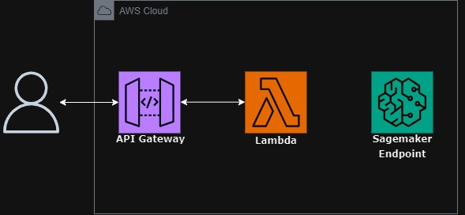

# AWS Sagemaker Classification model API

This repository contains a notebook that outlines the process of building, training and deploying a classification ML model using AWS SageMaker.

## Contents

- [Architecture](#architecture)
- [Requirements](#requirements)
- [Steps](#Steps)
- [Usage](#usage)
- [Dataset](#dataset)


## Architecture



The following are the AWS services used:
- AWS Sagemaker
- AWS Lambda
- AWS API Gateway 

## Requirements

- urllib
- pandas
- boto3
- sagemaker 
- json
- ast

```bash
pip install pandas boto3 urllib3 sagemaker 
```
An AWS account with access to AWS Sagemaker, AWS Lambda and API gateway is required.

## Steps

The notebook is divided into the following steps:

1. **Data Preparation** - convert the column with the names of the classes to numbers, shuffle the data, test-train split.
2. **Moving data into S3 bucket** - move the test-train splits to an S3 bucket.
3. **Create Model** - using XGBoost algorithm, set [hyperparameters](https://docs.aws.amazon.com/sagemaker/latest/dg/xgboost_hyperparameters.html). 
4. **Training** - train the model.
5. **Deploy** - create an endpoint.

After deploying the model, an AWS lambda function is created to interact with the SageMaker endpoint. This function sends the prediction request to the model and receives the prediciton result. This function is triggered by an API Gateway, allowing applications to make predictions by sending a POST request with input data. 

## Usage

Send input data through a POST request to the URL of the API and it returns the class it belongs to. 

Here's a POST request and the response:

```http
POST /dev/ HTTP/1.1
Host: -------.execute-api.us-east-1.amazonaws.com
Content-Type: text/plain
Content-Length: 46

{'x1': 5.3, 'x2': 3.7, 'x3': 1.5, 'x4': 0.2}
```

```http
HTTP/1.1 200 OK
Date: Tue, 30 Jan 2024 19:53:11 GMT
Content-Type: application/json
Content-Length: 17
Connection: keep-alive

{"prediction": "Iris-setosa"}
```

## Dataset
The dataset used in this project is the [Iris Dataset](https://archive.ics.uci.edu/dataset/53/iris). The dataset contains 3 classes (Iris setosa, Iris virginica, Iris versicolor) of 50 instances each, with 4 features (length and widths of sepals and petals.)
